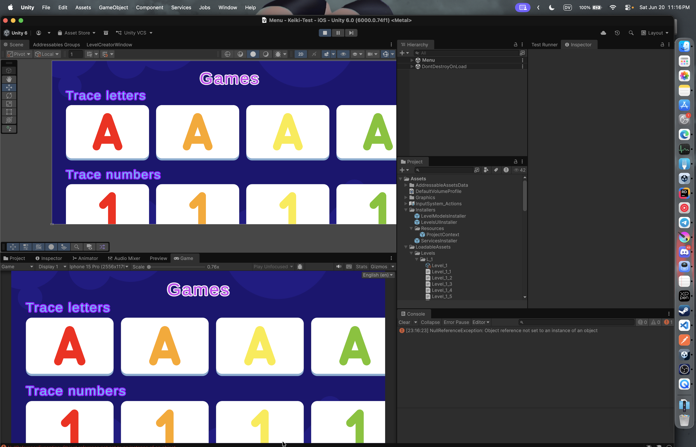
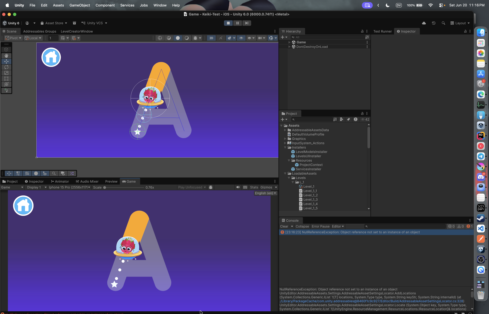

## Keiki - Test project
The test project for the Middle / Senior Unity Developer position at Keiki. (https://keiki.app/)

## Technical requirements
- Unity 6000.0.74f1
- Touch
- Test resolutions:
  - 19.5:9 (iPhone 15 Pro, 2556×1179) 
  - 4:3 (iPad Pro 12.9", 2732×2048).

## Used packages
- [Extenject](https://github.com/Mathijs-Bakker/Extenject/tree/master)
- [UniTask](https://github.com/cysharp/unitask)
- [Addressables](https://docs.unity3d.com/Packages/com.unity.addressables@3.0/manual/index.html)
- [EasyButtons](https://github.com/madsbangh/EasyButtons)
- [Unity localization](https://docs.unity3d.com/Packages/com.unity.localization@1.0/manual/index.html)
- [Unity Splines](https://docs.unity3d.com/Packages/com.unity.splines@2.4/manual/index.html)
- [Unity.UI.Extensions](https://github.com/Unity-UI-Extensions/com.unity.uiextensions)

## [Full task description is availabe in Presentation folder](./Presentation/Task.pdf)

## Presentation

https://github.com/user-attachments/assets/9659d183-d60c-44b5-ba6c-1d296880b6fb

[Shape creation video](./Presentation/ShapeCreation.mp4)

## Possible improvements
- Avoid using OnValidate for the preview feature. It is better to use a custom inspector.
- Save shapes name to be able to restore them when loading in the creator tool window.
- Add reactions when a user fails to move the shape.
- Add an ability to change the game environment based on the current level.
